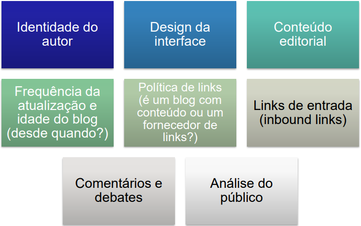
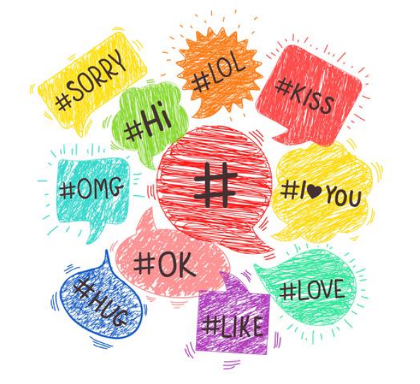
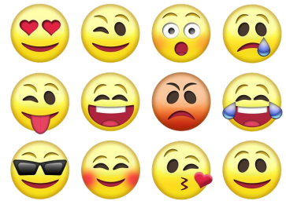
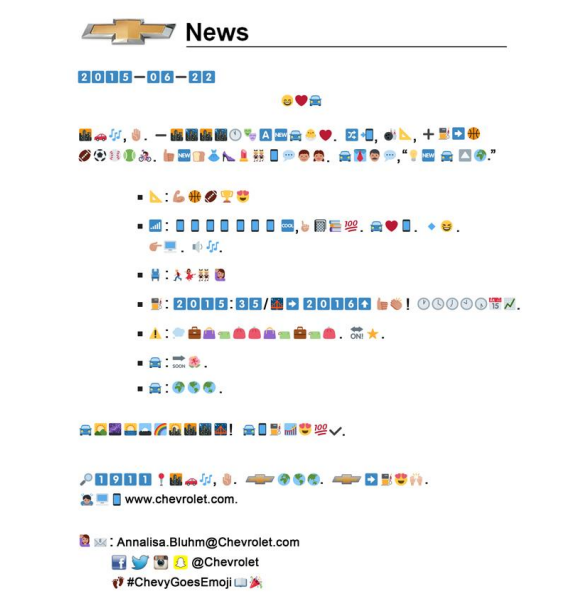
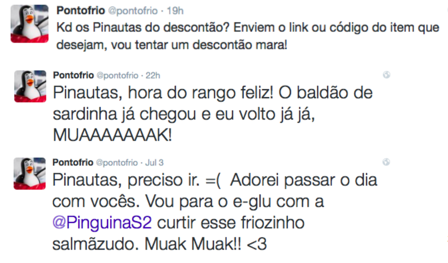
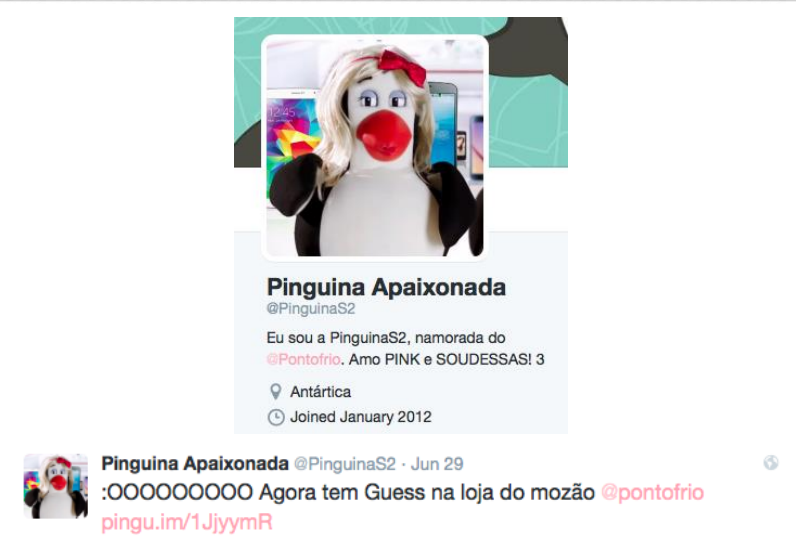

# Tópicos

[Blogueiros e Vlogueiros de Plantão](#blogueiros-e-vlogueiros-de-plantã)

[#Hashtags](#hashtags)

[A Emoção Digital](#a-emoção-digital)

[A Flexibilidade da Abordagem](#a-flexibilidade-da-abordagem)

# Blogueiros e Vlogueiros de Plantão

### Blog -> Weblog:

Web: remete à internet;

Log: designa o registro,
desempenho ou atividade
de algo regular. 

Um diário virtual.

“Por ser a publicação on-line
**centralizada no usuário e nos**
**conteúdos**, e não na programação
ou no design gráfico, os blogs
multiplicaram o leque de opções
dos internautas de levar para a
rede **conteúdos próprios sem**
**intermediários**, atualizados e de
grande visibilidade para os
pesquisadores”
(ORIHUELA, 2007, p. 2)

• A maioria das redes sociais
funcionam como espécies de
microblogs;

• Canal de expressão de
opinião;

• Muitos blogueiros assumem
um papel como o de um jornalista;

• Classe formadora de opinião e com poder de
influência no público;

• Influência esta que é formada pelo
relacionamento.

• Os blogs são, também, uma
mídia digital;

• Assumem importante função
estratégica em uma campanha digital.

• Mídia + formador de opinião = impactos
qualificados;

• Grande poder de segmentação.

• Aceitamos indicações de
amigos porque confiamos
neles;

• Esta premissa vale também
para os blogueiros;

• Os blogs minimizam o
desconhecimento de marcas
novas e potencializam as
organizações já constituídas
no mercado.

### Pontos para serem analisados ao escolher um blog para associar a sua marca:

• “Ok, professor. Mas, e nos **Vlogs**, o que muda?”

### Vlogs

• Mantenha a mesma linha de pensamento de um blog;

• Vlogs são como blogs em vídeo;

• Vídeos são a nova onda nos compartilhamentos de
conteúdos;

• Muitos vlogs ficaram famosos graças a viralização de,
muitas vezes, apenas um de seus vídeos;

• O YouTube impulsionou os vlogs;

• Muitos blogs e vlogs
categorizam as temáticas
de suas discussões e as
vinculam com **#hashtags**.

# [👆 TÓPICOS](#tópicos)

# Hashtags

• “Uma tag é uma palavra atribuída a
uma parte do conteúdo que ajuda a
descrevê-lo” (TELLES, 2011, p. 205);

• Hashtags são **palavras-chaves** que
categorizam informações;

• A função da hashtag é organizar, classificar e
agrupar assuntos pertinentes a um tema de
discussão na web;

• A classificação é feita pelo próprio usuário;

    • Exemplo: organização de fotos em seu dispositivo eletrônico.

• Estas palavras-chaves podem ser
um linguajar novo: **folksonomia**.

• Folksonomia: indexar informações
a partir do linguajar natural.

• Ex: #semfiltro, #instadog, #selfie.

• Mas, uma perguntinha básica:
#Você #sabe #como #utilizar #uma #hashtag?

• Bom, se a hashtag é uma forma de **indexar** e
**categorizar** informações, ela:

    • NÃO é legenda;

    • NÃO é negrito;

    • NÃO é destaque.

• Tag = etiqueta, marcadores;

• Também pode ser usada como
chamada de uma campanha publicitária.

• Entendeu? Vamos a um exemplo.

### Usos corretos da hashtag:

• #RioDeJaneiro #PãoDeAçúcar
#Paisagem #Praia #Oceano
#VistaAérea #Brasil

• “Visitei o #Rio e não quero mais ir
embora da #CidadeMaravilhosa!”

• “Pena que minhas #férias estão acabando, já estou com
saudades do #Rio!”

### Usos incorretos da hashtag seriam:

• #AiQueCoisaMaisLindaMeuDeus!

• #Favela #Paris #Londres #Balada

• “Eu estou #cansado mas curtindo demais as minhas
férias!” (utilizar hashtag para dar destaque a uma palavra que não se contextualiza com a imagem)

# [👆 TÓPICOS](#tópicos)

# A Emoção Digital

• “A hashtag categoriza, ok. Mas, como consigo me
**expressar** no diálogo virtual?”

• Imagine a seguinte troca de mensagens:
    
    - Oi, bom dia! Que saudades de você! Você dormiu bem? Está tudo bem?

    - Sim. Tudo bem.

• Agora, veja este mesmo diálogo desta forma:

    - Oi, bom dia! Que saudades de você! Você dormiu
    bem? Está tudo bem?

    - Sim 😊 Tudo bem 😊

• O que você faria se lesse este aviso:
    
    • “ATENÇÃO! Devido a um experimento de física recente, o elevador mais à esquerda está contaminado com mercúrio. Há também um dano superficial causado por fogo. A descontaminação deve ser concluída até 8h de sexta-feira.” (FREIRE, 2016)

    • Nascimento do “smiley”: :-)

    • Criado em 1982 pelo professor Scott Fahlman;

• **Emoticon** = emotion + icon = emoção em ícone;

• **Emoticon** = combinações tipográficas para
representar emoções;

• Em 1990 surgem os **Emojis**: desenhos que
representam emoções;

• “Emoji” deriva, do japonês, “e”
de imagem e “moji” de personagem;

• O primeiro emoji criado foi um
coração.

### Caso real: #ChevyGoesEmoji – Chevrolet Cruze:

Fonte: O Autor.
Matéria na íntegra no BlueBus. Disponível em <http://www.bluebus.com.br/chevrolet-divulga-press-release-feito-so-de-emojis-mas-alguem-entendeu/>.

• Isso nos mostra que:

    • Devemos acompanhar as tendências comunicacionais nas esferas digitais;

    • As formas de expressão ganham novas   representações ao longo dos anos;

    • As empresas precisam adequar sua linguagem de acordo com o público.
    
• Precisamos ter **abordagens flexíveis**.

# [👆 TÓPICOS](#tópicos)

# A Flexibilidade da Abordagem

• Atender e solucionar o problema do cliente independente do ponto de contato;

• Minimizar o translado intermidiático ao máximo;

• Facilitar a vida do cliente;

• Utilizar linguagem adequada a cada ponto de contato;

• Exemplos: Reclame Aqui e Circuito de Corridas
Paraná Running.

### A Flexibilidade da Abordagem Caso Real: Ponto Frio

# [👆 TÓPICOS](#tópicos)

# Considerações Finais

• Blogs e Vlogs são importantes plataformas formadoras de opiniões;

• Em um plano de e-marketing, as
#hashtags assumem funções mais
estratégicas do que aparentam;

• A necessidade de expressar
sensações e sentimentos é uma
constante no comportamento do internauta.

• Uma empresa precisa ser atuante e presente em
todos os pontos de contato com seus clientes.

# [👆 TÓPICOS](#tópicos)

# Referências

ORIHUELA, José Luis. **Blogs** e blogosfera: o meio e a comunidade. In: ORDUÑA, Octavio I. Rojas et al. Blogs: revolucionando os meios de comunicação. São Paulo: Thompson Learning, 2007. p. 1-20.

TELLES, André. **A Revolução das Mídias Sociais**: cases, conceitos, dicas e ferramentas. São Paulo: M. Books do Brasil, 2011. 

FREIRE, Rachel. **Entenda a diferença entre smiley, emoticon e emoji**. 31/07/2014. Disponível em:
<http://www.techtudo.com.br/noticias/noticia/2014/07/entenda-diferencaentre-smiley-emoticon-e-emoji.html>. Acesso em: 15 Fev. 2016. 

# [👆 TÓPICOS](#tópicos)