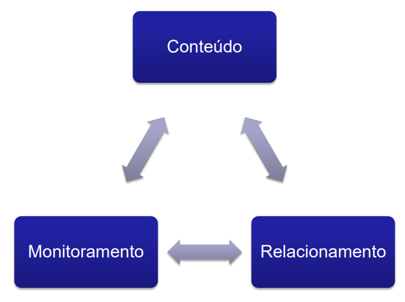
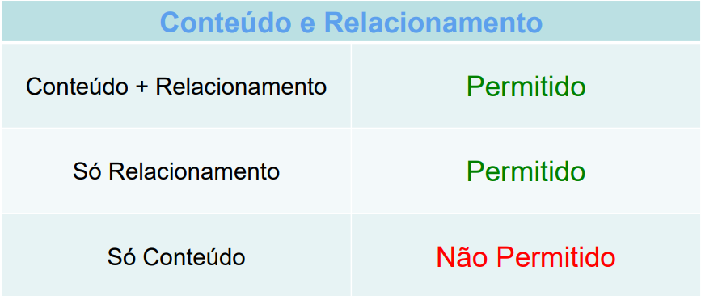
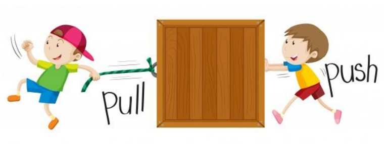
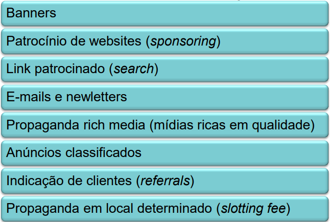
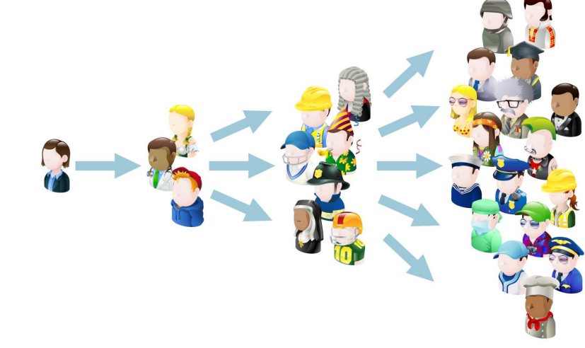
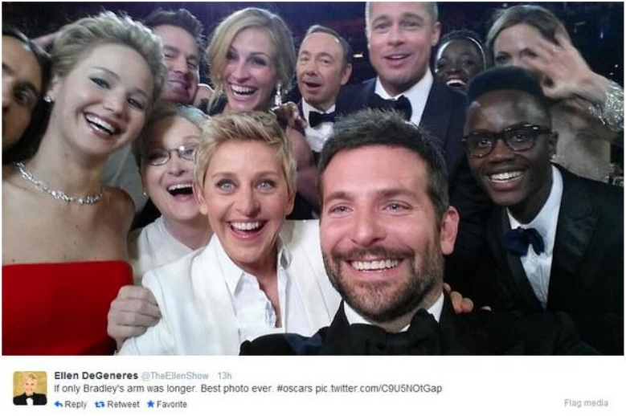
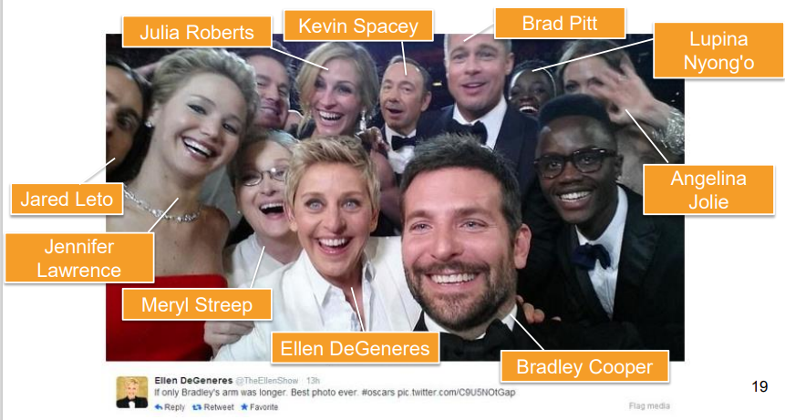
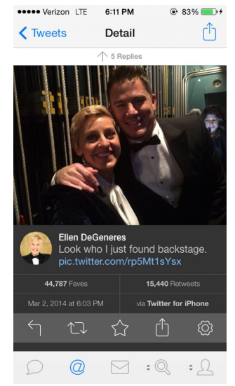
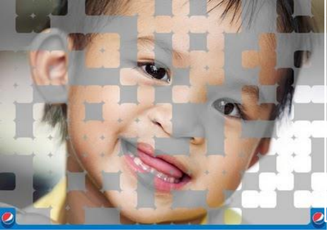
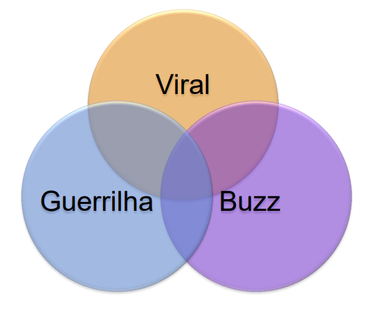

# Tópicos

[**O Tripé Mágico**: Conteúdo, Relacionamento e Monitoramento](#o-trip%C3%A9-m%C3%A1gico-conte%C3%BAdo-relacionamento-e-monitoramento)

[**Puxa ou Empurra?** - O Marketing Puxado e o Marketing Empurrado](#puxa-ou-empurra---o-marketing--puxado-e-o-marketing-empurrado)

[Publicidade Online](#publicidade-online)

[Viral, Barulho e Guerrilha](#viral-barulho-e-guerrilha)

[Considerações Finais](#considera%C3%A7%C3%B5es-finais)

# O Tripé Mágico: Conteúdo, Relacionamento e Monitoramento

### Relacionamento
- Um anúncio divulga e estimula a venda, mas 
sozinho não perdura.

- Relacionar significa vivenciar algo, coexistir, 
participar de algo, se envolver;

- Relacionamento implica em proximidade;

- A internet permite esta proximidade:
“[...] os recursos eletrônicos proporcionam dados 
mais precisos, com maior rapidez, nos níveis micro 
e macro de mercado”
> (REEDY; SCHULLO; ZIMMERMAN, 2001, p. 48). 

### Conteúdo
- Uma das formas de se relacionar é através da 
geração de conteúdo;

- Conteúdo ≠ dados sobre a marca ou produto;

- Conteúdo = informações relevantes, interessantes, 
que vão além do oferecido pela empresa, que gera 
conhecimento;

- Postagens com conteúdos devem ser frequentes;

- Exemplo: site de um restaurante;

### Monitoramento
- Acompanhar, seguir, manter um olhar paralelo às 
situações que acontecem no entorno;

- Estar atento aos comentários de clientes em 
postagens da empresa, enviados por e-mail ou 
mesmo soltos e descontextualizados;

- Monitorar ações nas redes sociais;

- Saber os diferentes perfis dos seguidores de cada 
plataforma digital da empresa.

O tripé mágico é como um casamento: para durar 
tem que ir muito além da conquista. 

- Mas, e se a empresa não tiver fôlego para 
sustentar o tripé mágico?

“Então o tripé mágico ajuda a **puxar** o consumidor 
para perto da empresa?”

# Puxa ou Empurra? - O Marketing  Puxado e o Marketing Empurrado

• **Marketing Puxado**: atrair clientes;

• **Marketing Empurrado**: forçar a venda de produtos;

• O marketing puxado procura criar a ambientação 
certa para a venda acontecer naturalmente.

• Exemplo: caso real Nike e iTunes.

### A Relação entre Conteúdo e  Marketing Puxado

“A ideia é gerar **conteúdo**
genuíno, útil e relevante para o 
consumidor, isento de 
interferência comercial.
**É ser útil de fato**, como uma 
rádio informando o melhor 
caminho em um momento de 
congestionamento [...]”

- “Mas, sobre as formas tradicionais de anúncios na 
web, elas são eficientes?”

# Publicidade Online

### Algumas formas tradicionais de publicidade online:

Link patrocinado e Banner são duas das formas 
mais comuns.

# Viral, Barulho e Guerrilha

### Outras formas de atingir o público online: 

- Marketing Viral;

- BuzzMarketing;

- Marketing de Guerrilha.

### Marketing Viral

- É o “boca-a-boca” da internet;

- Se espalha como um vírus, é contagioso;

- Deve estar alinhado com o posicionamento;

- Geralmente cômico (propaga mais rápido).

- Possui riscos (o resultado pode ser negativo);

- Permite potência e visibilidade por um lado e, por 
outro, perde direcionamento e controle da ação

### Caso Real: Samsung Oscar 2014

- Em **50 minutos** se tornou o tweet com mais RT’s
da história passando a casa de 1 milhão.
- Obama: 778 mil.

- Em Janeiro/2018: 

- Ao todo ação custou US$ 20 milhões para a 
Samsung, incluindo comercial de televisão no 
intervalo da cerimônia;

- Popularizou a #Selfie.

- Mas, nos bastidores...

# BuzzMarketing

- Fazer “barulho”, atrair a atenção, promover 
discussão, engajar;

- É mais focado e segmentado do que o viral;

- Procurar atuar em um target pré-definido;

- Uma ação de Buzz pode vir a se tornar um viral;

- A linha que limita um Buzz de um Viral é bastante 
tênue.

### Pepsi: Operação Sorriso (#os_pepsi)

- Foto totalmente colorida 
(250 tweets #os_pepsi) = 
1 cirurgia de fissura 
labiopalatal paga pela 
Pepsi.

- Total de 112.500 tweets, 
ou 450 cirurgias.

### O Boticário: dia dos namorados 2015.

Disponível em: <https://www.youtube.com/watch?v=hAlLEv4GYj4>. Duração: 30”.

- Polêmica: Relacionamento de homem com homem e mulher com mulher

# Marketing de Guerrilha
- Guerrilhar – trincheiras;

- Busca contato direto com o cliente;

- Promove experiências diferenciadas;

- Geralmente utiliza mídias offline inusitadas;

- Envolve o receptor em momentos que não espera 
ser impactado.

### TNT: falta drama na sua vida?

Vídeo disponível em: <https://www.youtube.com/watch?v=_5a7F1x4OPg>. Duração: 1’45”.

- Não são excludentes:

# Considerações Finais

- Não podemos apenas estar 
presente nas redes sociais, 
devemos **ser presentes**;

- O marketing puxado fortalece o 
relacionamento entre organização e 
internautas, sendo mais propenso a 
deixar os clientes satisfeitos;

- Marketing Viral, BuzzMarketing e Guerrilha podem 
ser trabalhados em conjunto.