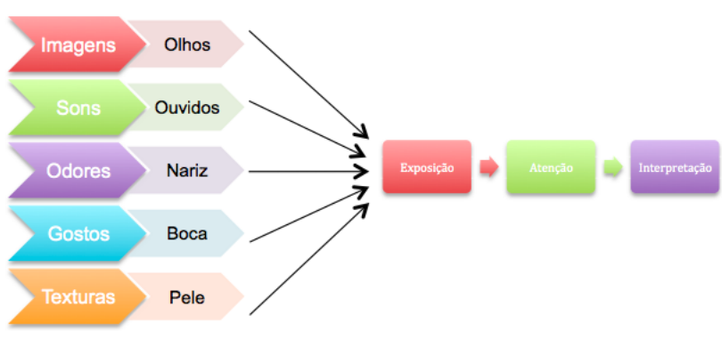

# Tópicos 

[O Comportamento do Consumidor Tradicional](#o-comportamento-do-consumidor-tradicional)

[O Comportamento do Consumidor Virtual](#o-comportamento-do-consumidor-virtual)

[Padrões de Comportamento dos E-Shoppers](#padrões-de-comportamento-dos-e-shoppers)

[Socialnomics](#socialnomics)

[Considerações Finais](#considera%C3%A7%C3%B5es-finais)

# O Comportamento do Consumidor Tradicional

Comportamento do consumidor 
“é o estudo dos processos 
envolvidos quando indivíduos ou 
grupos selecionam, **compram**, 
**usam** ou **descartam** produtos, 
serviços, ideias ou experiências 
para satisfazer **necessidades** e 
**desejos**”

> (SOLOMON, 2011, p. 33)

Compreender as principais teorias sobre o 
comportamento dos consumidores é, também, 
conhecer atalhos para trabalhar o Marketing de  uma maneira mais eficaz;

O consumidor atual tem um perfil mais
**imediatista** e **controlado**. De acordo com uma
pesquisa da PwC, ele está menos propenso a
realizar compras, principalmente de itens
considerados “supérfluos”. Mas, quando o
consumidor decide por comprar algum item, a
mesma pesquisa indica que eles estão cada
vez mais digitais, com crescimento de quase
50% nas compras por celular.

De um lado estão as experiências do comprador e do outro estão os fatores que o levaram a tal experiência. Ou seja, de um lado o **ponto de vista do consumidor** e do **outro o ponto de vista do marketing**.

### PERFIL = CARACTERÍSTICA

Idade média: Homens de 34 anos de idade;

**Público geral: 18 e 49 anos, representando 70% das**
**vendas.**

Esse público costuma ir em estreias das grandes
franquias, como “Os Vingadores” e “Jurassic World”, e
gasta 2,6 vezes mais no cinema do que um espectador
médio.

### Perspectiva do consumidor Vs perspectiva do marketing:

- Uma compra é definida 
por avaliações;

- As avaliações levam à
tomada de decisão;

- O processo de compra é 
determinado pelos 
agentes influenciadores 
que incidem na tomada 
de decisão;

- Durante todas estas etapas há comunicação.

- Então, como funciona o processo de 
comunicação?

### Processo de Comunicação

###  Comunicação -> Sinestesia.

#### Visão geral do processo perceptivo.

- E para o consumidor virtual, o que muda?

# O Comportamento do Consumidor Virtual

- Receptor Retransmissor;

- Mesmo produto, experiência distinta;

- Web como apoio para compra física e vice-versa.

# Padrões de Comportamento dos E-Shoppers

- **E-Shopper**: clientes virtuais;

### Perfis de E-Shoppers

# Socialnomics

- Comportamento nas redes sociais

“Os ‘**muros**’ invisíveis para 
a comunicação estão 
sendo **quebrados** diária, 
local e globalmente com a 
internet
> (QUALMAN, 2011, p. 9) 

• Posts são tatuagens sociais,
moldando uma personalidade
online;

• Há aquelas que gostam de
compartilhamentos excessivos
e os que prezam pela 
privacidade;

• Pedir o número de telefone de alguém mudou para 
pedir algum perfil social.

- “O que acontece em Vegas, 
fica em Vegas”, *será*?

• Corrida dos “Likes”;

• Engajamento Pessoal Vs
Engajamento Empresarial.

• Cada vez **mais redes pessoais** e
cada vez **menos redes empresariais**.

# Considerações Finais

- Comportamento -> tomada de 
decisão.

• Tomada de decisão ≠ ser racional.

• Consumidor virtual pode assumir 
papel de retransmissor. 

• Compras físicas e virtuais se
distanciam na experiência da compra.

• Redes sociais mais intimistas.
