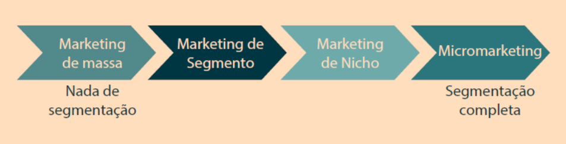
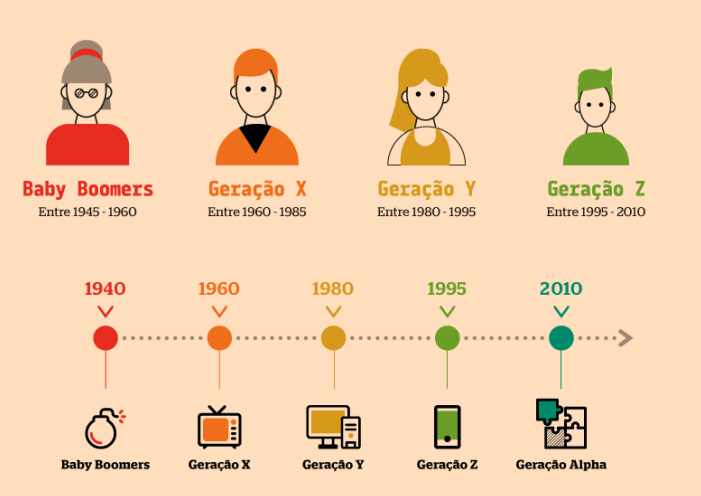
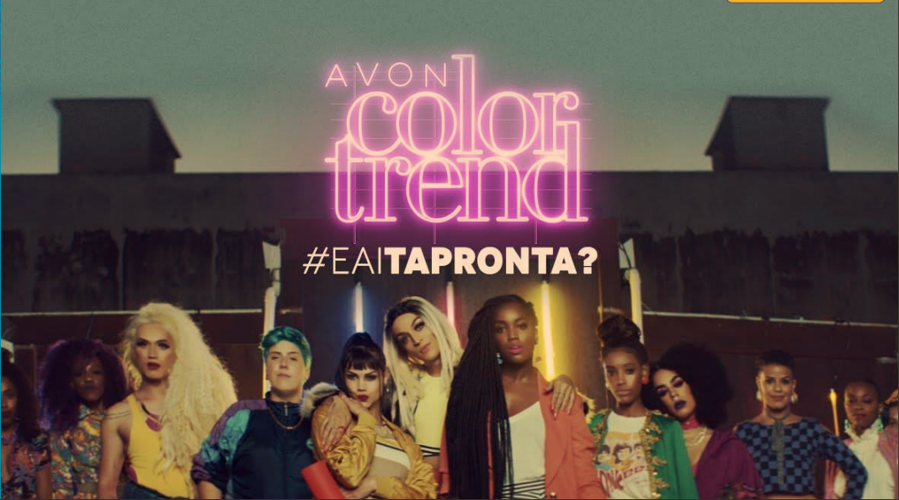

# Tópicos

[A História por trás da Comunicação](#a-hist%C3%B3ria-por-tr%C3%A1s-da-comunica%C3%A7%C3%A3o)

[Gerações](#gera%C3%A7%C3%B5es)

[Baby Bommers e X](#baby-boomers-e-x)

[Geração Y](#geração-y)

[Geração Z e Alpha](#gerações-z-e-alpha)

[A Evolução do Marketing](#a-evolu%C3%A7%C3%A3o-do-marketing)

# A História por trás da Comunicação

“A origem da comunicação está baseada na
necessidade que o homem sentiu de
codificar seus sentimentos” (FIGUEIREDO, 1999, p. 17)

• Nós temos a necessidade de nos
comunicarmos, é algo que nasce com o ser
humano.

• Comunicação ≠ fala, escrita etc.

• Comunicação é inata.

• A fala e escrita são adquiridas.

“A comunicação não existe por si
mesma, como algo separado da vida
da sociedade. **Sociedade e**
**comunicação** são uma coisa só. Não
poderia existir comunicação sem
sociedade, nem sociedade sem
comunicação. A comunicação não
pode ser melhor que sua sociedade
nem esta melhor que sua
comunicação. Cada sociedade tem a
comunicação que merece”

O ser humano possui um sistema de comunicação bastante complexo e elaborado. Não apenas
pela quantidade de palavras, estruturas gramaticais, regras de escrita ou pela quantidade enorme
de idiomas que utiliza para compartilhar informações, mas também por toda a bagagem
interpretativa que o ato de comunicar exige, toda reflexão, toda critica e toda argumentação
possíveis de serem articuladas em uma mensagem.

• Cultura e sociedade:
**Teia de significados**

→ **Socializar** não e apenas trocar palavras. E por isso que a Comunicação não se restringe ao
campo lexical.

• Algo é representado não
apenas por sua
descrição, mas por seu
caráter simbólico.

→ Através da **arte**, o ser humano pode comunicar a concepção que tem das coisas. Na
verdade, uma imagem vale não apenas por seu valor descritivo, mas também por seu
significado simbólico”.

• Já contextualizamos a Comunicação. Agora nos
perguntamos: onde se encaixa o Marketing em
meio a isso?

### Conceito de Vendas:

### Conceito de Marketing:

“um processo social e gerencial
pelo qual indivíduos e grupos
obtém o que necessitam e
desejam através da criação, oferta
e troca de produtos de valor com
outros”

# [👆 TÓPICOS](#tópicos)

# A Evolução do Marketing

Níveis de segmentação de mercado:

• Marketing ≠ Vendas ≠
Comunicação;

• A evolução do marketing está
diretamente ligada à
evolução do homem;

• Os comportamentos
diferentes de cada geração
estimulam novas práticas do
marketing;

# [👆 TÓPICOS](#tópicos)

# Gerações

**Satisfação do Cliente** = compreender o homem

Por isso, precisamos
entender também como
o próprio homem se
desenvolveu ao longo
das últimas décadas.

# [👆 TÓPICOS](#tópicos)

# Baby Boomers e X
**Baby Boomers** Entre 1945 á 1960
**X** Entre 1690 á 1985

<https://www.youtube.com/watch?v=98e6rKv9lO0>

Podemos perceber no vídeo que:
• a estabilidade era um dos pontos mais importantes no período pós-guerra;

• **Baby Boomers (BB)** com uma profissão a vida toda;

• **BB** gostavam de manter as coisas simples;

• **Geração X** competitiva e buscava crescimento rápido;

• Meritocracia podia pesar mais que a experiência para os
**X** (ideias lucrativas, MBAs, especializações, currículo);

• **Geração X** possuía uma lógica mais
individualista;

• **Geração X** começou a misturar trabalho
com vida pessoal.

# [👆 TÓPICOS](#tópicos)

# Geração Y
1980 to 1995

<https://www.youtube.com/watch?v=98e6rKv9lO0>. 

Podemos perceber no vídeo que para os Y:

• é importante aproveitar o caminho, a jornada;

• apenas o longo prazo não é interessante;

• estruturas hierárquicas tradicionais não funcionam;

• idade não é sinônimo de poder/conhecimento;

• títulos e diplomas não são as formas mais importantes de se adquirir conhecimento;

• não basta ter um trabalho, tem que ter um
propósito;

• imagem virtual extremamente relevante.

# [👆 TÓPICOS](#tópicos)

# Gerações Z e Alpha
**Geração Z** Entre 1945 á 1960
**Geração Alpha** Entre 2010 aos dias atuais

• Há um hiato tecnológico entre as gerações;

• Tecnologia é plano de fundo para os **Alfas**;

• Estruturas antigas já não funcionam mais com as novas gerações;

• Restrições de antigamente já não se aplicam.

• Empresas estagnadas serão engolidas.
• O **marketing** vai (e precisa!) continuar
**evoluindo**

# [👆 TÓPICOS](#tópicos)
