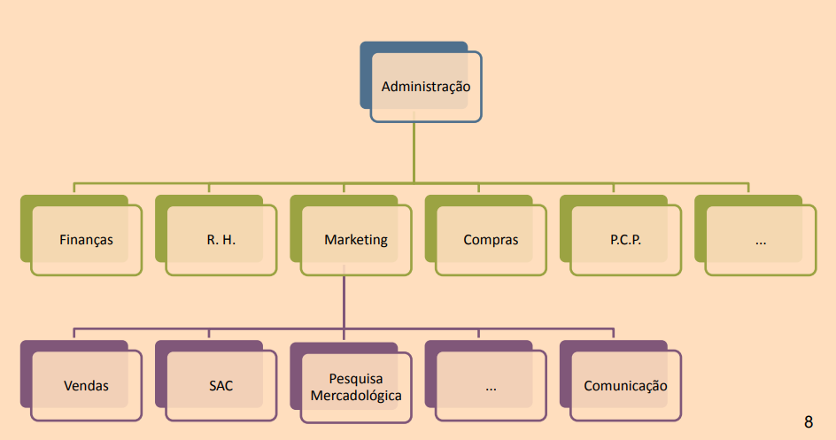
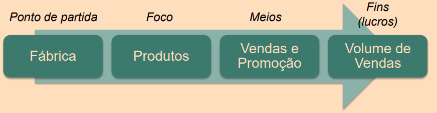
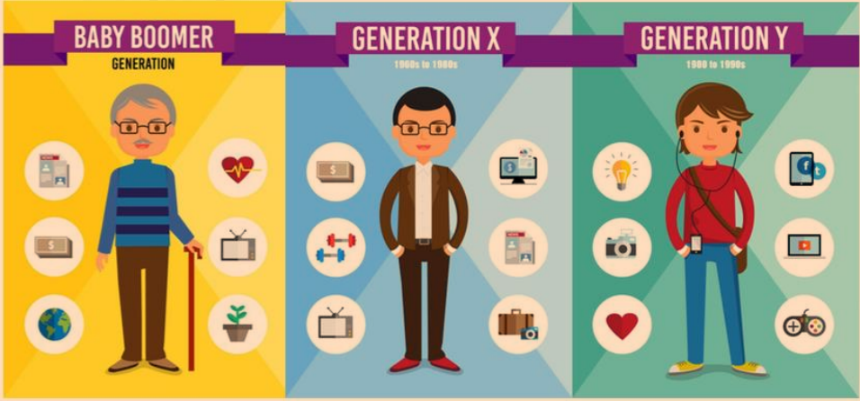

# Tópicos

[A História por trás da Comunicação](#a-hist%C3%B3ria-por-tr%C3%A1s-da-comunica%C3%A7%C3%A3o)

[Gerações](#gera%C3%A7%C3%B5es)

[A Evolução do Marketing](#a-evolu%C3%A7%C3%A3o-do-marketing)

# A História por trás da Comunicação

“A origem da comunicação está baseada na
necessidade que o homem sentiu de
codificar seus sentimentos” (FIGUEIREDO, 1999, p. 17)

• Nós temos a necessidade de nos
comunicarmos, é algo que nasce com o ser
humano.

• Comunicação ≠ fala, escrita etc.

• Comunicação é inata.

• A fala e escrita são adquiridas.

“A comunicação não existe por si
mesma, como algo separado da vida
da sociedade. **Sociedade e**
**comunicação** são uma coisa só. Não
poderia existir comunicação sem
sociedade, nem sociedade sem
comunicação. A comunicação não
pode ser melhor que sua sociedade
nem esta melhor que sua
comunicação. Cada sociedade tem a
comunicação que merece”

• Cultura e sociedade:
**Teia de significados**

• Algo é representado não
apenas por sua
descrição, mas por seu
caráter simbólico.

• Já contextualizamos a Comunicação. Agora nos
perguntamos: onde se encaixa o Marketing em
meio a isso?

### Conceito de Vendas:

### Conceito de Marketing:

# Gerações

**Satisfação do Cliente** = compreender o homem

Por isso, precisamos
entender também como
o próprio homem se
desenvolveu ao longo
das últimas décadas.

### Baby Boomers e X

<https://www.youtube.com/watch?v=98e6rKv9lO0>

Podemos perceber no vídeo que:
• a estabilidade era um dos pontos mais importantes no período pós-guerra;

• **Baby Boomers (BB)** com uma profissão a vida toda;

• **BB** gostavam de manter as coisas simples;

• **Geração X** competitiva e buscava crescimento rápido;

• Meritocracia podia pesar mais que a experiência para os
**X** (ideias lucrativas, MBAs, especializações, currículo);

• **Geração X** possuía uma lógica mais
individualista;

• **Geração X** começou a misturar trabalho
com vida pessoal.

### Geração Y
1900 to 1990

<https://www.youtube.com/watch?v=98e6rKv9lO0>. 

Podemos perceber no vídeo que para os Y:

• é importante aproveitar o caminho, a jornada;

• apenas o longo prazo não é interessante;

• estruturas hierárquicas tradicionais não funcionam;

• idade não é sinônimo de poder/conhecimento;

• títulos e diplomas não são as formas mais importantes de se adquirir conhecimento;

• não basta ter um trabalho, tem que ter um
propósito;

• imagem virtual extremamente relevante.

### Gerações Z e Alpha

• Há um hiato tecnológico entre as gerações;

• Tecnologia é plano de fundo para os **Alfas**;

• Estruturas antigas já não funcionam mais com as novas gerações;

• Restrições de antigamente já não se aplicam.

• Empresas estagnadas serão engolidas.
• O **marketing** vai (e precisa!) continuar
**evoluindo**

# A Evolução do Marketing

Níveis de segmentação de mercado:

• Marketing ≠ Vendas ≠
Comunicação;

• A evolução do marketing está
diretamente ligada à
evolução do homem;

• Os comportamentos
diferentes de cada geração
estimulam novas práticas do
marketing;
