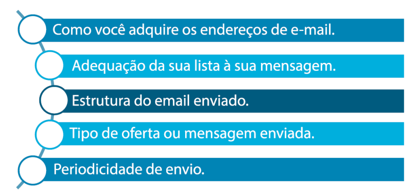
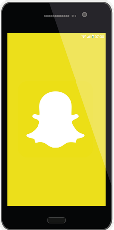
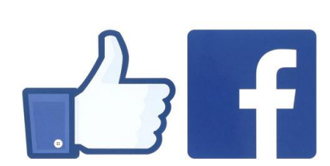
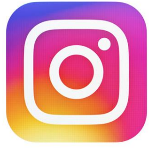
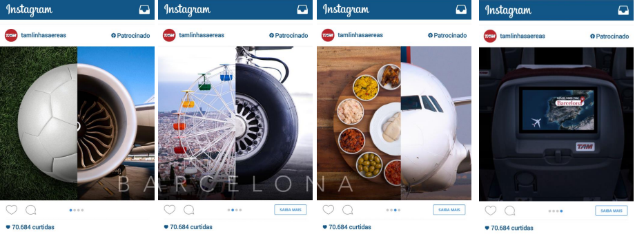
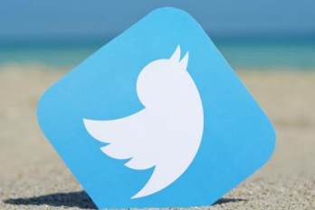

[O Sintoma da Conectividade e o Email](#o-sintoma-da-conectividade-e-o-email)

[Redes Sociais](#redes-sociais)

[Snapchat](#snapchat)

[Facebook](#facebook)

[Instagram](#instagram)

[Twitter](#twitter)

[Instagram VS Twitter](#instagram-vs-twitter)

[Youtube](#youtube)

[Whatsapp](#whatsapp)

[Considerações Finais](#considerações-finais)

[Referências](#referências)

# O Sintoma da Conectividade e o Email

### Reflexões iniciais sobre a Conectividade:

• Qual o papel das redes sociais em nossas
vidas?

• Como pautamos nossas relações interpessoais?

• Por que há uma “necessidade” de estarmos
conectados?

• Por que uma rede social faz mais sucesso que
outra?

• Qual o valor da mensuração por likes para um
internauta

### Você se lembra da Teia de Significados que comentamos na Unidade I?

“Acreditando, como Max Weber, que o
homem é um animal amarrado a **teias**
**de significados** que ele mesmo teceu,
assumo a cultura como sendo essas
teias e a sua análise; portanto, não
como uma ciência experimental em
busca de leis, mas como uma **ciência**
**interpretativa, à procura do significado”**

• A **Conectividade** é um reflexo cultural.

• Assim, compreender os significados culturais
permite melhor conhecimento de seu público-alvo.

### Um exemplo de um sintoma da conectividade:

• Mala Direta Vs. E-mail;

• E-mail Vs. Login Social.

O uso de e-mails vai chegar a um fim?

• Não subestime a força do email marketing.

• Fatores que influenciam no email marketing:

O e-mail marketing:
“deve ser visto não como uma
ação pontual, mas **integrado**
em uma estratégia mais
completa de relacionamento
com os clientes”

Integrado com... Redes Sociais!

# [👆 TÓPICOS](#tópicos)

# Redes Sociais

# Snapchat:

Primeiramente: por que falar de Snapchat se é uma
plataforma que perdeu sua representatividade?

• Recusou uma oferta de US$ 3 bilhões
do Facebook em 2013, quando a receita
anual do Snapchat era de US$ 0
(isso mesmo, zero!);

• No início 2016 o valor do Snapchat foi
estimado em US$ 15 bilhões.

• Mudou o comportamento das empresas:
postagens com apelos diferentes.

• Conteúdo compartilhado fica público por
apenas 24 h., dando margem para as
empresas arriscarem campanhas mais
audaciosas.

• A instantaneidade sem históricos, a
“selfie sem make”;

• Os usuários não possuem a mesma
preocupação com as publicações
como nas demais plataformas sociais;

• Zela pelo compartilhamento de um
momento de maneira livre, sem pensar
nas consequências;

• Rede social mais intimista.

• Não estimulou a “corrida de likes” que existe em
outras redes sociais.

• O Snapchat desconstruiu uma das grandes
premissas presentes na esfera digital:
a popularidade.

• Muitos da Geração Y “afirmaram que se sentem
felizes ao serem livres do Facebook porque **não**
**precisam mais sustentar aparências por lá**”, e
ainda acreditam que “**diante de tanto conteúdo**
**e anúncios, existe pouco espaço para uma real**
**socialização entre amigos neste ambiente**”
(GAMONAR, 2016); espaço este que foi encontrado
no Snapchat.

### Snapchat – 3V Advertising:
• Publicidade dos 3V’s (Vertical Video Views):

• **Vertical**: porque é feito para
celulares;

• **Video**: porque é a melhor forma
de se contar uma história;

• **Views**: porque sempre será visto
em fullscreen e em um contexto,
evitando anúncios soltos e
invasivos.

• O Snapchat introduziu uma nova maneira
de interação virtual e uma nova forma e
formato de publicidade em mídias sociais.

# [👆 TÓPICOS](#tópicos)

# Facebook

• Onipresente.

• Comprou o Whatsapp, o
Instagram e outras.

• Não restinge caracteres ou uso de imagem/vídeo.

• Excelente plataforma profissional (ferramentas de
gestão).

• Está constantemente se reinventando.

• Fácil (mesmo!) de anunciar: impulsionar páginas,
publicações, eventos. Tanto os grandes como os
pequenos podem utilizar!

• **Receptor Transmissor**: “as pessoas
atuando como mídias dentro de
uma outra mídia, compartilhando
conteúdo que pode ter sido
veiculado, veja só, em uma terceira mídia” (p. 118).

• Um dos maiores diferencias: preocupação em fornecer
condições para os usuários terem sua rede de contatos.

• Caricatura das postagens:
    
    • Todo mundo tem opinião sobre alguma coisa;
    
    • Leitores de manchetes;
    
    • Espaço para discussão (positiva, negativa, produtiva ou não).

• As principais fanpges não são necessariamente as com
mais curtidas, mas sim as com maiores engajamentos (relacionamento).

• Estimula o uso de vídeos e transmissões ao vivo
(isso te lembra os 3Vs?).

• Lançou o modo Histórias, que possibilita ao usuário
compartilhar momentos que ficarão online por
apenas 24 horas (isso te lembra o Snapchat?).

# [👆 TÓPICOS](#tópicos)

# Instagram

• O momento em imagem;

• Mídia social imediatista (menos do
que quando lançada, mas ainda assim).

• Uso obrigatório de imagem;

• Estimula o uso de hashtags;

• Versão completa disponível apenas em celulares
(mobilidade);

• Fotos com tratamento – Filtros;

• Double Tapping simula um aplauso.

• Inúmeros aplicativos surgiram em
função do Instagram;

• Fácil de anunciar, possibilitando
tanto empresas grandes como
pequenas;

• Preocupação forte com qualidade das imagens
postadas;

• Caricatura das postagens: “vida feliz e tudo lindo”;

• Preocupação com qualidade dos anúncios.

### Instagram - Caso Real

• Anúncio da TAM no Instagram:

### Instagram - Stories

• Em uma atualização incluiu o
modo Stories, que permite
publicações que ficam online
por apenas 24 horas. Foi a
partir deste ponto que o
Snaptchat perdeu forças no Brasil.

• Empresas vêm conseguindo mais engajamento
com o Stories do que com postagens tradicionais (lembra dos 3Vs?)

### Instagram - Dicas para o Stories

• O Stories deve ser utilizado com
os mesmos princípios do Snapchat.
É essencial que não ocorram
postagens repetidas, já publicadas
no modo tradicional do Instagram.

• Ainda, a frequência de posts do
Stories deve ser maior do que a do modo tradicional,
visto que fica disponível apenas por 24 horas.

• Recomenda-se preparar as imagens para seu Stories
antes e postar todas de uma vez.

• É interessante publicar um stories como um "bastidor" de um post

# [👆 TÓPICOS](#tópicos)

# Twitter

• Mistura de rede social com
blog e ferramenta de
comunicação;

• Notas Oficiais em poucos
caracteres.

• Amplamente utilizado por celebridades e figuras
públicas (Pessoalidade Vs Assessoria de Imprensa).

• Suporta texto, imagem e/ou vídeos.

• Um dos responsáveis pela popularização da
#Hashtag.

• Importante plataforma de
contato com os clientes;

• Pode servir como uma espécie
de SAC;

• Preza pelo instante: trending
topics (TT’s).

• Evitar que o cliente translade entre mídias para
obter uma resposta;

# [👆 TÓPICOS](#tópicos)

# Instagram Vs. Twitter

• Ambas prezam pelo instante, pelo agora;

• Instagram valoriza mais a imagem: foto antes da
legenda.

• Twitter valoriza mais o texto: legenda antes da imagem.

• Anúncios:

    • Instagram: poético;

    • Twitter: normais.

• Profundidade de discussão:
    • Instagram: fraca;
    
    • Twitter: forte.

# [👆 TÓPICOS](#tópicos)

# YouTube

• **Conteúdo**;

• Receptor assume funções de:
Criador, produtor e consumidor;

• Cada vez mais assume características de uma
**TV virtual**;

• Anúncios:
    • Inserções em canais consagrados;

    • Anúncios Google nos vídeos (links);
    
    • Anúncios antes dos vídeos (com ou sem
espera obrigatória).

### Youtube - Caso Real

• Comercial Geico Seguros

• “Você não pode pular este anúncio porque ele já
acabou”. Disponível em: <https://www.youtube.com/watch?v=PA_An6LcWtc> Duração: 1’04”.

# [👆 TÓPICOS](#tópicos)

# Whatsapp

• Não vende anúncios.

“Ninguém acorda animado para ver
mais anúncios, [...]. Sabemos que as
pessoas vão dormir animadas com
quem conversaram aquele dia [...].
Queremos que o WhatsApp seja um
produto que deixe você acordado...
E aquele pelo qual anseia de manhã.
Ninguém acorda de uma soneca e
corre pra ver um anúncio” Veja artigo na íntegra disponível em <http://blog.whatsapp.com/index.php/2012/06/why-we-dont-sell-ads>. Acesso em: 07 Jan 2018.

• Substituiu o uso do celular para
envio de SMS e, cada vez mais,
para realizações de chamadas.

• Mensagem instantânea para
envio de texto, áudio, vídeos,
imagens, documentos, mapas,
entre outros.

• Funciona em desktop desde que
o smartphone esteja logado.

Coloque-se no lugar do consumidor: será que eu
gostaria de ser abordado por uma marca pelo
WhatsApp ou com comerciais no YouTube?

E quando surgir uma nova rede social que não
estudamos aqui, o que devo fazer?

# [👆 TÓPICOS](#tópicos)

# Considerações Finais

• Redes Sociais prezam pela
instantaneidade;

• Devemos saber identificar a
**essência** de cada plataforma para
aplicarmos abordagens condizentes;

• Integração das mídias sociais não é
sinônimo de replicar conteúdo.

• A conectividade faz parte das relações culturais do
homem moderno.

# [👆 TÓPICOS](#tópicos)

# Referências

GEERTZ, Clifford. **A interpretação das culturas**. 1. ed. Rio de Janeiro: LTC, 2008.

LIMEIRA, Tania M. Vidigal. **E-Marketing**: o marketing na internet com casos

brasileiros. 2. ed. São Paulo: Saraiva, 2010.
TORRES, Cláudio. **A Bíblia do Marketing Digital**: tudo o que você queria saber sobre marketing e publicidade na internet e não tinha a quem perguntar. São Paulo: Novatec, 2009.

# [👆 TÓPICOS](#tópicos)